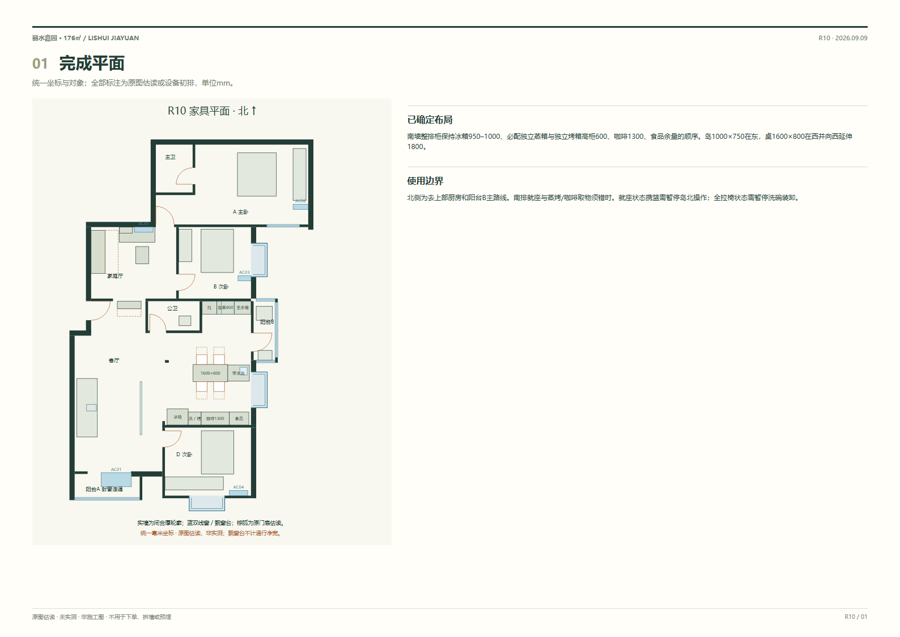

# 丽水嘉园176㎡ · R10 横向带水岛桌与南侧风管机

南墙柜保持冰箱、必配分体蒸烤、咖啡、食品的原位置与顺序。岛1000×750在东，桌1600×800在西、向西延伸1800；岛东部增加辅助小水槽及冷热水，原主水槽、洗碗机和800净备菜保留。

北侧主路线：就座净带1000、全拉椅650，均为估读算例。南排就座与蒸烤/咖啡取物须错时；携600衣篮时，就座状态暂停岛北操作，全拉椅状态暂停洗碗装卸。南移仅余48即碰蒸烤全开门，不计作通道。

岛槽排水初排3.452m，2%需69.04mm落差。接入标高和可用地面厚度待测，**重力排水未成立**；保留带水和平地需求，不默认地台、提升泵或结构开槽。

阳台A封窗并连通客厅，AC01在交界顶面局部吊顶内向北送风、客厅侧回风；公共区冷量含餐区。AC05普通挂机在家庭厅北侧A门洞以西，桌上书柜集中西侧。吊顶高度、维护净距、孔位、冷凝水及外机均待核。

B/C/D飘窗、门窗、入户转折、公卫和阳台恢复为统一毫米模型，新增原图半透明叠合、风管机吊顶和岛槽给排水剖面。原图估读不是实测净尺寸；燃气使用条件未确认合规。文件验证不替代现场安装验收。

- [30页离线方案册](deliverables/方案册.html)
- [完成平面](deliverables/01-furniture.svg)
- [拆改与原门洞](deliverables/02-alterations-review.svg)
- [水电定位](deliverables/03-services.svg)
- [南墙柜立面](deliverables/04-cabinet-access.svg)
- [蒸烤取物与咖啡立剖面](deliverables/05-coffee-sideboard.svg)
- [家庭厅与AC05](deliverables/06-utility-storage.svg)
- [四人、六人和南移边界](deliverables/07-island-dining.svg)
- [满开与操作占用](deliverables/08-appliance-clearance.svg)
- [北侧通行与七类工作顺序](deliverables/09-workflows.svg)
- [五套独立空调](deliverables/10-air-conditioning.svg)
- [原图半透明叠合](deliverables/11-source-overlay.svg)
- [风管机局部吊顶剖面](deliverables/12-ac01-ceiling-section.svg)
- [岛槽给排水平面与剖面](deliverables/13-island-water-section.svg)
- [家具尺寸表.csv](deliverables/家具尺寸表.csv)
- [设备预留表.csv](deliverables/设备预留表.csv)
- [水电点位表.csv](deliverables/水电点位表.csv)
- [现场核验表.csv](deliverables/现场核验表.csv)
- [新图面积标注.csv](deliverables/新图面积标注.csv)
- [新图尺寸标注.csv](deliverables/新图尺寸标注.csv)
- [电器上下水表.csv](deliverables/电器上下水表.csv)
- [底图对位核验.csv](deliverables/底图对位核验.csv)
- [渲染、几何及分页核查](deliverables/verification.json)

运行 `python deliverables/build_package.py` 与 `python deliverables/render_verify.py`。依赖Playwright、PyMuPDF、Pillow及Chromium/Edge（可设FURNISH_BROWSER）。几何统一于 `deliverables/r10_geometry.py`。PDF仅在内存验证，不写入或修改已有PDF；Git继续排除PDF、ZIP、加密文件及缓存。
