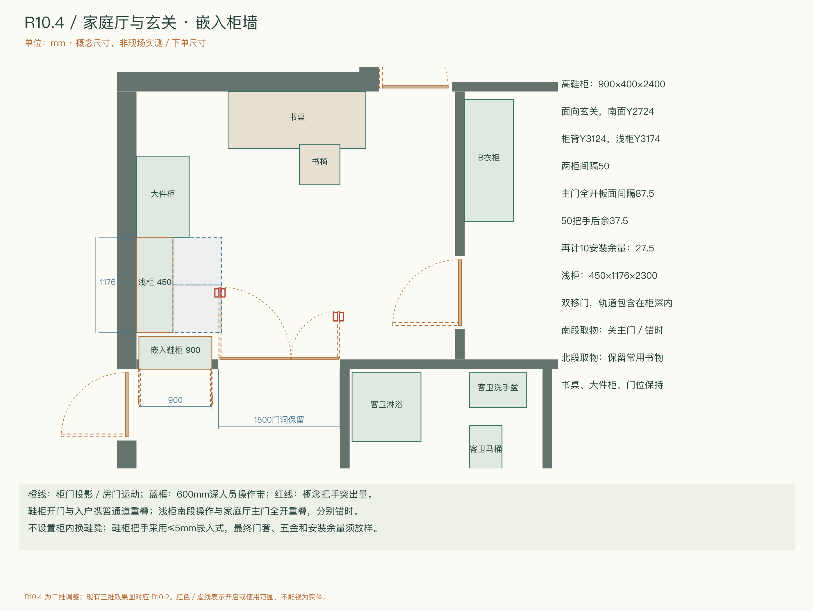

# 丽水嘉园176㎡ · R10.4 二维方案

本次仅发布独立二维方案包，未更新Blender模型、GLB或三维效果图，也未合并未完成的R10.3发布副本。R10.4沿用R10.3二维布局并落实玄关／家庭厅调整。

[离线方案册](deliverables/r10.4/方案册.html) · [检查说明](deliverables/r10.4/检查说明.md) · [改动对照](deliverables/r10.4/改动说明.md) · [核验报告](deliverables/r10.4/verification.json)

HTML方案册请下载后在浏览器打开。GitHub可直接查看SVG、PNG和CSV。

- 高鞋柜900×400×2400，嵌入家庭厅入口左侧柜墙；上下封闭，中间350高置物格，不设换鞋凳。
- 西南浅柜缩至1176，保持450深，改用双移门；子母门1500、书桌及大件柜保持。
- 标准鞋型八层理论24双；大码鞋、长靴与鞋盒需重新配层。
- 完整600mm衣篮路线按112组状态核验；鞋柜关闭、正常就座及门固定打开时条件可达，北排拉椅与取物需错时。
- 原主卧A门50mm把手假设在87–90°碰西墙，五金定稿暂停；柜墙可改性、门框固定和线路待现场。

[鞋柜立面](deliverables/r10.4/diagrams/14-shoe-elevation.svg) · [柜墙剖面](deliverables/r10.4/diagrams/15-cabinet-section.svg) · [全屋平面](deliverables/r10.4/diagrams/01-furniture.svg) · [衣篮路线](deliverables/r10.4/diagrams/10-workflows.svg) · [全部图纸](deliverables/r10.4/diagrams) · [表格](deliverables/r10.4/tables) · [发布质量检查](deliverables/r10.4/quality_check.json)

本机现有效果图对应R10.2，不能代表R10.4二维布局。结构、燃气、岛槽排水及唯一淋浴使用条件继续保留。

[历史R10.2二维资料](deliverables/README.md) · [原三维资料（本次未改）](model3d/README.md)

本次GitHub发布为R10.4二维展示包：完整图纸、表格、当前二维数据及核验报告。旧版完整几何基准和依赖它的重建程序保留本地，不随本次上传；报告内的生成方法仅为本地核验追溯。
